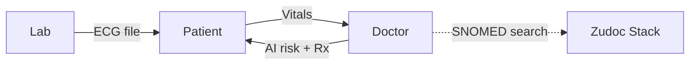
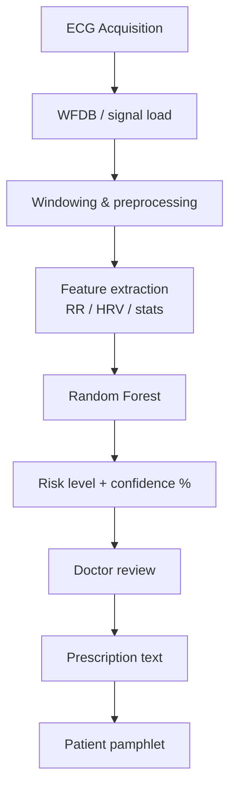
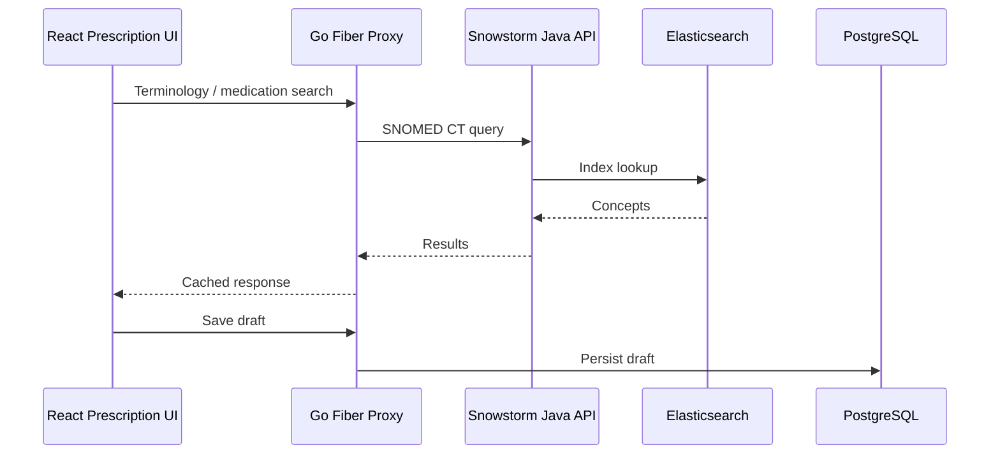
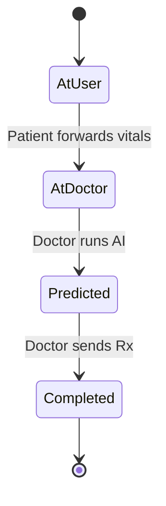
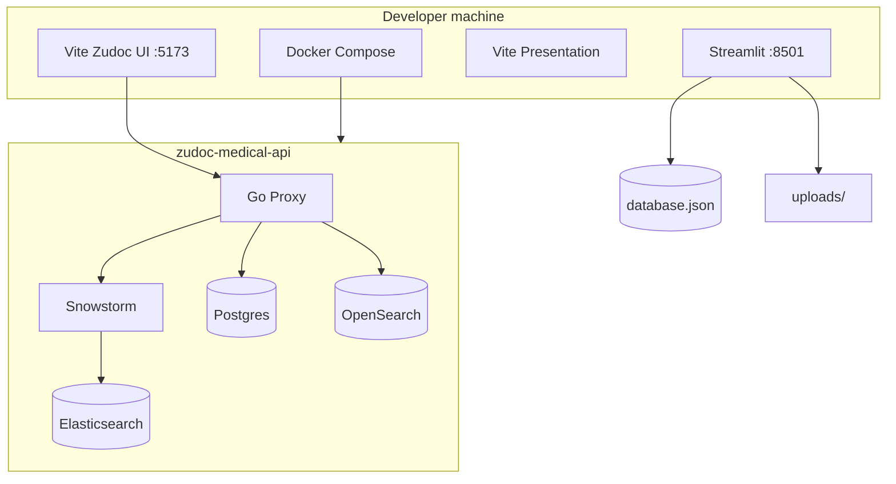

# HealthGuard AI — System Architecture

This document describes the multi-layer architecture of the HealthGuard AI platform as implemented in this repository.

---

## 1. High-level overview

HealthGuard is a **multi-portal clinical ecosystem**:

1. **Lab** acquires and uploads ECG diagnostics.
2. **Patient** completes vitals and forwards the case.
3. **Doctor** runs explainable AI screening and issues a prescription.
4. Optional **Zudoc** stack provides SNOMED CT terminology search for standardized clinical terms.

---

## 2. Layered architecture

### Layer 1 — User interface

| Portal | Tech | Responsibilities |
| :--- | :--- | :--- |
| Laboratory | Streamlit | ECG upload (`.dat`, `.csv`, `.txt`), bind to patient email |
| Patient | Streamlit | Pending lab actions, vitals entry, view completed prescriptions |
| Doctor | Streamlit | Patient queue, Random Forest prediction, prescription authoring |
| Zudoc UI | React + Vite | Prescription workspace, medication/lab forms, AI assistant panels |

### Layer 2 — Application services

Implemented primarily in `Sleep-apnea-prediction-using-ecg/app.py` and `db_handler.py`:

- Role-based session auth (Patient / Doctor / Lab)
- Submission CRUD and status transitions
- File storage under `uploads/`
- In-app chatbot (`chatbot.py`)

### Layer 3 — AI engine

| Step | Detail |
| :--- | :--- |
| Acquisition | Lab uploads ECG tied to patient email |
| Processing | WFDB / NumPy / Pandas |
| Features | 12 statistical & HRV-related features |
| Classifier | Pre-trained `best_sleep_apnea_model.pkl` |
| Output | Normal / Mild / Moderate / Severe + confidence |
| Why RF | Strong on tabular physiological features; interpretable feature importance |

### Layer 4 — Clinical terminology (Zudoc)

- **Go proxy:** query coalescing (`singleflight`), in-memory TTL cache  
- **Java Snowstorm:** FHIR-aligned terminology server  
- **OpenSearch:** pharmaceutical search path (where configured)

### Layer 5 — Data stores

| Store | Used by | Purpose |
| :--- | :--- | :--- |
| `database.json` | Streamlit portals | Submissions, predictions, prescriptions |
| PostgreSQL 15 | Zudoc | Prescription drafts |
| Elasticsearch 8.x | Snowstorm | SNOMED CT evaluation |
| OpenSearch 2.9 | Search proxy | Medication search |

---

## 3. Submission state machine

Statuses are authoritative in `db_handler.py`:

| Status | Transition trigger |
| :--- | :--- |
| `At User` | `add_submission(email, file_path)` from Lab portal |
| `At Doctor` | `update_patient_details(id, vitals)` from Patient portal |
| `Predicted` | `update_submission(..., prediction=...)` from Doctor AI run |
| `Completed` | `update_submission(..., prescription=...)` from Doctor |

---

## 4. Component map (repository)

| Path | Role |
| :--- | :--- |
| `Sleep-apnea-prediction-using-ecg/app.py` | Streamlit portals & UI |
| `Sleep-apnea-prediction-using-ecg/db_handler.py` | JSON persistence & status API |
| `Sleep-apnea-prediction-using-ecg/main.py` | Model training / evaluation |
| `Sleep-apnea-prediction-using-ecg/chatbot.py` | Patient-facing assistant |
| `Sleep-apnea-prediction-using-ecg/best_sleep_apnea_model.pkl` | Trained Random Forest |
| `zudoc-medical-api/` | Snowstorm + search proxy + Docker stack |
| `zudoc-medical-api/Prescriptioncreationinterface-main/` | Clinical prescription React app |
| `healthguard-presentation/` | Product / architecture pitch deck |

---

## 5. Deployment topology (local)

---

## 6. Design principles

1. **Portal isolation** — Lab, Patient, and Doctor only see relevant queue states.  
2. **Explainable AI** — Risk + confidence before clinical action; doctor remains decision-maker.  
3. **Actionable output** — Prediction alone is incomplete; prescription closes the loop.  
4. **Standards-ready** — SNOMED CT path for interoperable clinical concepts.  
5. **Modular growth** — Same architecture can host additional disease models (e.g. cardiovascular).

---

## 7. Future roadmap (architecture)

| Phase | Direction |
| :--- | :--- |
| 1 | OSA (ECG → RR/HRV → Random Forest) — **current** |
| 2 | Cardiovascular risk models on the same portal + queue pattern |
| 3 | Multi-modal inputs (SpO₂, BP, labs, wearables) |
| 4 | Continuous monitoring & real-time alerts |
| 5 | Multi-hospital / federated clinical deployment |
