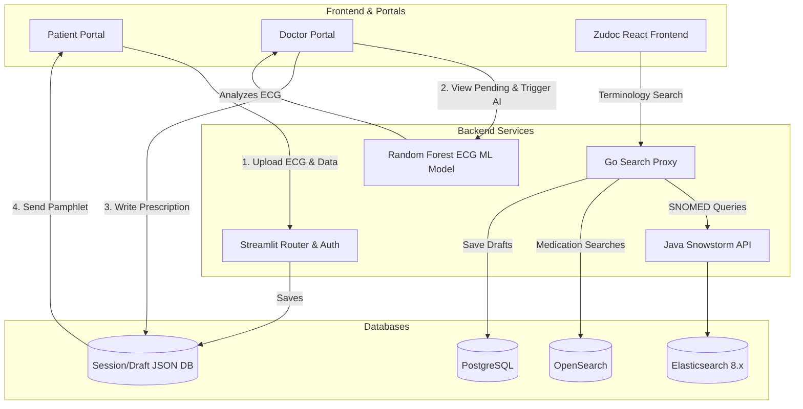

# AI-Powered Health Risk Analyzer & Clinical Portal

An enterprise-grade, multi-role medical ecosystem combining an AI-powered Sleep Apnea ECG prediction model with a full-stack clinical terminology and prescription management system. 

This repository is a monolithic integration of two major systems:
1. **Sleep Apnea Prediction System**: A Python/Streamlit based AI model analyzing ECG signals to predict sleep apnea risk levels.
2. **Zudoc Medical API**: A robust React + Go/Java microservice backend for high-performance clinical terminology search (SNOMED CT) and prescription management.

---

## 🏛️ System Architecture

The platform supports a comprehensive clinical workflow from patient data intake to automated AI diagnosis and final doctor prescription generation.



---

## 🛠️ Technology Stack

### AI Prediction System (Sleep Apnea)
- **Frontend & Routing**: Streamlit (Python)
- **Machine Learning**: Scikit-Learn (Random Forest Classifier), Pandas, NumPy, WFDB (for ECG parsing)
- **Data Persistence**: Local JSON simulation (`db_handler.py`)
- **UI/UX**: Custom injected CSS mirroring clean, light medical themes.

### Clinical Portal (Zudoc)
- **Frontend**: React 18, Vite, TypeScript, TailwindCSS
- **Search Proxy Microservice**: Go (Fiber), `singleflight` query coalescing, thread-safe memory TTL cache
- **Terminology Server**: Java (Snowstorm API)
- **Databases**:
  - PostgreSQL 15 (Patient Prescription Drafts)
  - Elasticsearch 8.x (SNOMED CT evaluation)
  - OpenSearch 2.9 (Pharmaceutical Searches)
- **Containerization**: Docker & Docker Compose

---

## 🚀 Getting Started (Run Instructions)

The repository contains all components. You will need to run the AI Model and the Zudoc Frontend/Backend in separate terminal sessions.

### 1. Run the AI Prediction Model & Portal
This component handles the multi-role (Patient/Doctor/Lab) portal and ECG predictions.
```bash
# Navigate to the sleep apnea project directory
cd Sleep-apnea-prediction-using-ecg

# Install Python dependencies
pip install -r requirements.txt

# Start the Streamlit application
streamlit run app.py
```
*Access the portal at `http://localhost:8501`. Login with any email/password.*

### 2. Run the Zudoc Frontend
This handles the specialized prescription creation interface.
```bash
# Navigate to the frontend directory
cd zudoc-medical-api/Prescriptioncreationinterface-main

# Install Node dependencies
npm install

# Start the development server
npm run dev
```
*Access the UI at `http://localhost:5173`.*

### 3. Run the Zudoc Backend Microservices
Ensure Docker Desktop is running before executing.
```bash
# Navigate to the zudoc root directory
cd zudoc-medical-api

# Start all databases and services in detached mode
docker-compose up -d
```
