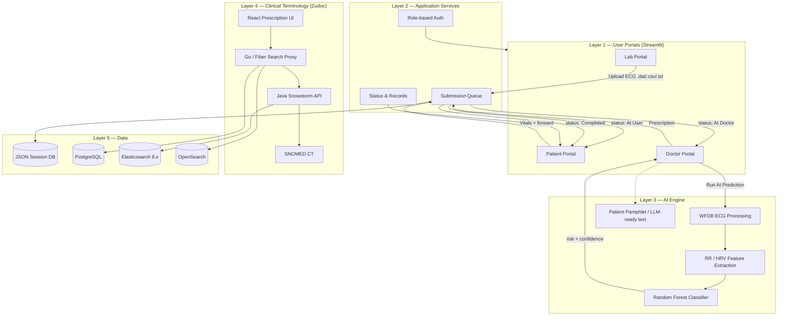
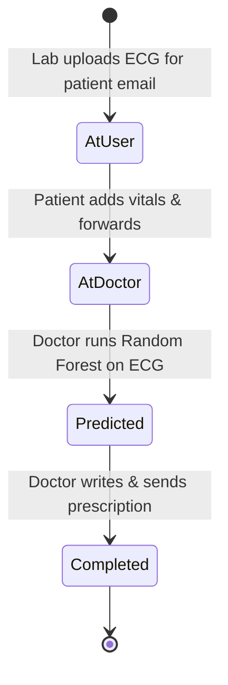

# HealthGuard AI — AI-Powered Health Risk Analyzer

An end-to-end clinical ecosystem that turns ECG signals into explainable sleep apnea risk predictions, then routes them through Lab, Patient, and Doctor portals into actionable prescriptions — with optional SNOMED CT terminology search via the Zudoc medical stack.

**Data → Predict → Automate → Resolve**

| | |
| :--- | :--- |
| **Primary focus** | Obstructive Sleep Apnea (OSA) screening from ECG |
| **Model** | Random Forest · **85.2%** accuracy (PhysioNet Apnea-ECG) |
| **Portals** | Laboratory · Patient · Doctor (Streamlit) |
| **Clinical stack** | React prescription UI · Go proxy · Java Snowstorm · Elasticsearch |
| **Team** | SRM University — Saravanan Sathishkumar, Evangelin John, Daiwakshya, Sumukesh |

---

## Repository layout

```text
├── Sleep-apnea-prediction-using-ecg/   # Multi-role Streamlit app + ML model
├── zudoc-medical-api/                  # Clinical terminology + prescription UI
├── healthguard-presentation/           # React pitch deck (Vite)
├── presentation.html                   # Standalone Reveal.js pitch deck
├── ARCHITECTURE.md                     # Detailed system architecture
└── reference ppt.pdf                   # Reference presentation
```

---

## System architecture

HealthGuard connects diagnostics, AI screening, and clinical action in one workflow.



### Clinical submission lifecycle



| Status | Owner | Action |
| :--- | :--- | :--- |
| `At User` | Patient | Review lab ECG package, enter vitals (age, SpO₂, etc.), forward to doctor |
| `At Doctor` | Doctor | Run AI prediction on ECG |
| `Predicted` | Doctor | Review risk level + confidence, write prescription |
| `Completed` | Patient | View medical record & prescription pamphlet |

Full diagrams and layer notes: **[ARCHITECTURE.md](./ARCHITECTURE.md)**.

---

## Technology stack

### Sleep Apnea AI & portals
- **UI / routing:** Streamlit (Python)
- **ML:** Scikit-Learn Random Forest, Pandas, NumPy, WFDB
- **Persistence:** Local JSON (`db_handler.py`)
- **Assist:** In-app medical chatbot

### Zudoc clinical portal
- **Frontend:** React 18, Vite, TypeScript, Tailwind
- **Search proxy:** Go (Fiber), query coalescing, TTL cache
- **Terminology:** Java Snowstorm (SNOMED CT)
- **Data:** PostgreSQL 15 · Elasticsearch 8.x · OpenSearch 2.9
- **Ops:** Docker Compose

### Pitch decks
- `healthguard-presentation/` — React + Framer Motion slides
- `presentation.html` — Reveal.js standalone deck

---

## Getting started

### 1. AI portals & prediction (required for demo)

```bash
cd Sleep-apnea-prediction-using-ecg
pip install -r requirements.txt
streamlit run app.py
```

Open `http://localhost:8501`. Sign in with any email/password and pick a role:

1. **Lab** — upload ECG and target patient email  
2. **Patient** — add vitals and forward to doctor  
3. **Doctor** — run AI prediction and send prescription  

### 2. HealthGuard presentation

```bash
cd healthguard-presentation
npm install
npm run dev
```

Or open `presentation.html` directly in a browser.

### 3. Zudoc prescription UI

```bash
cd zudoc-medical-api/Prescriptioncreationinterface-main
npm install
npm run dev
```

### 4. Zudoc backend (Docker)

```bash
cd zudoc-medical-api
docker-compose up -d
```

---

## Model performance

Trained on the **PhysioNet Apnea-ECG Database**.

| Metric | Value |
| :--- | :--- |
| Accuracy | 85.2% |
| Precision | 82.1% |
| Recall | 78.9% |
| F1-Score | 80.4% |
| ROC-AUC | 0.87 |

**12 features:** time-domain stats, energy/RMS, zero-crossing rate, HRV-related difference measures.

---

## Disclaimer

For **preliminary screening and educational use only**. Not a substitute for professional medical diagnosis or treatment.

---

## Team

| Name | Role |
| :--- | :--- |
| Saravanan Sathishkumar | Lead Architect & AI Integration |
| Evangelin John | Frontend & UX |
| Daiwakshya | Backend Microservices |
| Sumukesh | Data & Systems Infrastructure |

**Institution:** SRM University
