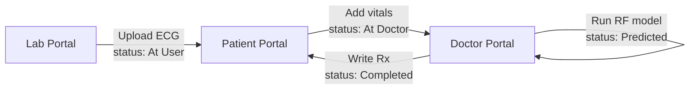
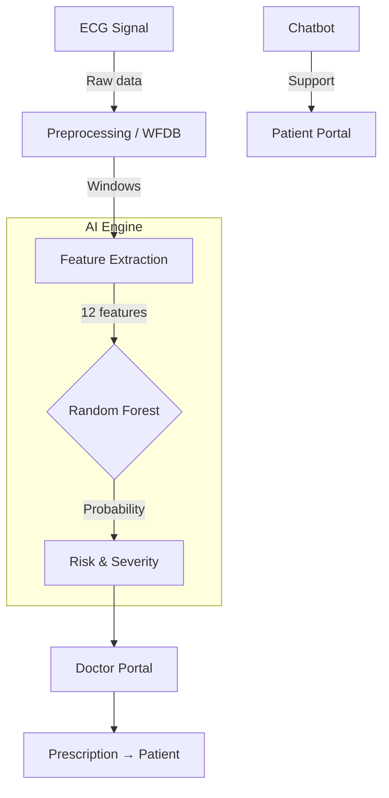

# Sleep Apnea Prediction from ECG Signals


Core AI module of **HealthGuard AI**: ECG-based Obstructive Sleep Apnea (OSA) screening with a multi-role clinical workflow (Lab → Patient → Doctor).

## Overview

Traditional OSA diagnosis (polysomnography) is costly and intrusive. This system uses heart-rate variability patterns in ECG to provide a fast, non-invasive preliminary severity assessment — then routes results through real clinical roles instead of stopping at a raw model score.

### Key features

- **ECG-based detection** — `.dat`, `.csv`, `.txt` uploads  
- **Random Forest** — ~**85.2%** accuracy on PhysioNet Apnea-ECG  
- **Severity classes** — Normal · Mild · Moderate · Severe (+ confidence)  
- **Three portals** — Laboratory, Patient, Doctor  
- **Chatbot** — In-app sleep apnea assistant  
- **Signal plots** — ECG windows and detection visuals  

## Clinical workflow architecture





| Status | Meaning |
| :--- | :--- |
| `At User` | Lab sent ECG; patient must enter vitals |
| `At Doctor` | Ready for AI prediction |
| `Predicted` | AI done; doctor writes prescription |
| `Completed` | Patient can view prescription |

## Model performance

| Metric | Value |
| :--- | :--- |
| **Accuracy** | 85.2% |
| **Precision** | 82.1% |
| **Recall** | 78.9% |
| **F1-Score** | 80.4% |
| **ROC-AUC** | 0.87 |

### Features extracted (12)

- **Time domain:** mean, std, min, max, median, 25th/75th percentiles  
- **Energy:** signal energy, RMS  
- **Complexity:** zero-crossing rate  
- **HRV-related:** std of differences, mean absolute difference  

## Getting started

### Prerequisites

- Python 3.8+  
- Git  

### Install & run

From the **repository root**:

```bash
cd Sleep-apnea-prediction-using-ecg
pip install -r requirements.txt
streamlit run app.py
```

Open `http://localhost:8501`. Use any email/password and select **Lab**, **Patient**, or **Doctor**.

**Demo path:** Lab uploads ECG for a patient email → Patient logs in, adds vitals, forwards → Doctor runs AI and sends prescription → Patient views completed record.

## Project structure

```text
├── app.py                      # Streamlit portals (Lab / Patient / Doctor)
├── db_handler.py               # JSON DB + status transitions
├── main.py                     # Training & evaluation
├── chatbot.py                  # Medical assistant
├── best_sleep_apnea_model.pkl  # Pre-trained Random Forest
├── requirements.txt
└── README.md
```

Parent repo docs: [../README.md](../README.md) · [../ARCHITECTURE.md](../ARCHITECTURE.md)

## Disclaimer

For **preliminary screening and educational purposes only**. Not a substitute for professional medical diagnosis or treatment.

---

Developed as part of **HealthGuard AI** — SRM University  
Saravanan Sathishkumar · Evangelin John · Daiwakshya · Sumukesh
