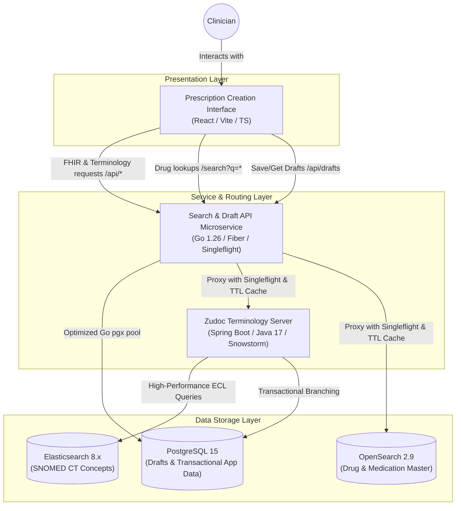

# Zudoc Medical API - Architecture Documentation

This document describes the architectural layout, data flow patterns, and service integration strategies of the Zudoc Medical API and Prescription Platform.

---

## 1. System Architecture

Zudoc is designed as a hybrid microservices-and-monolith architecture utilizing three specialized database systems to balance transaction processing, semantic clinical searches, and high-performance medication indexing.

---

## 2. Structural Tiers

### Presentation Tier (Clinical Workspace)
- **Framework**: React 18, Vite, TypeScript.
- **Portals**: Six isolated clinical portals (General/Allopathy, Ayurveda, Dental, Siddha, Nursing, Veterinary) partition clinical state to prevent data cross-contamination.
- **Smart Suggestions**: Local histories are boosted based on frequency (Flame icon, selection count $\ge 3$) and recency (Clock icon, used within 24h). Up to 1,000 items are stored per workspace field.
- **Fast-Response Inputs**: The dropdown engine skips backend lookups when query inputs are empty or under 3 characters, relying instead on instantaneous local caches and fallback defaults.
- **Auto-Capture & Persistence**: Automatically logs symptoms, diagnoses, medications, labs, radiology, and surgeries to the local database when clicking AI suggestions, saving drafts, or submitting final signed prescriptions.

### Service Tier (Go Search & Caching Microservice)
- **Framework**: Go, Fiber v2.
- **Location**: `/search-service`
- **Key Capabilities**:
  - **Singleflight Query Merging**: Uses `golang.org/x/sync/singleflight` to merge concurrent identical queries. Only one request hits the database/search cluster; the result is shared across all waiting requests.
  - **Connection Sanitization**: Parses and sanitizes database connection strings (`DATABASE_URL`) to strip out Prisma-specific parameters (like `schema=public`) before pool instantiation, resolving connection timeouts.
  - **Memory Cache**: A thread-safe TTL Cache (1-hour lifespan) prevents repetitive queries for static SNOMED CT and Medication concepts from hitting databases.
  - **High-Performance PostgreSQL Driver**: Connects to PostgreSQL via pgx connection pool (`pgxpool`) with tuned pool settings (`MaxConns: 50`, `MinConns: 5`).
  - **Draft Management**: Handles fast upserts of prescription JSON payloads utilizing PostgreSQL's native `JSONB` data types.

### Core Terminology Engine (Zudoc Medical API)
- **Framework**: Java 17, Spring Boot.
- **Ecosystem**: Built upon **Snowstorm**, the leading international SNOMED CT terminology server.
- **Standards**: Fully implements the **HL7 FHIR R4 Terminology Specification** endpoints:
  - `$expand`: Dynamic value-set expansion (evaluating hierarchical ECL constraints like `<< 404684003`).
  - `$lookup`: Concept semantic mapping.
  - `$subsumes`: Evaluating lineage/is-a relationships.
- **Location**: `/src` (Java Terminology Engine)

---

## 3. The Tri-Database Strategy

To maintain sub-second response times, Zudoc separates data domains into three specialized database engines:

| Engine | Storage Type | Main Dataset | Optimization Goal |
| :--- | :--- | :--- | :--- |
| **Elasticsearch 8.x** | Search Index | SNOMED CT Terminology | Fast ECL evaluations, prefix-matching, and semantic concept lookups. |
| **OpenSearch 2.9** | Search Index | Drug Master (Medications) | Fuzziness-tolerant lookup of pharmaceutical formulations, decoupled from terminology. |
| **PostgreSQL 15** | Relational | Patient Drafts & Visit Data | Strict ACID consistency, transactional reliability, and fast JSONB draft queries. |

---

## 4. Key Performance Optimizations

1. **Short-Circuit Short and Empty Queries**: The frontend and backend skip database REST calls when the input search query is under 3 characters (`query.trim().length < 3`), ensuring that focusing and initial typing takes $0\text{ ms}$ and does not trigger table scans or return server errors.
2. **Coalesced Fetching & Request Merging**: Utilizes Promise-based request registries on the frontend and `singleflight` coalescing on the backend to combine duplicate concurrent searches (e.g. tag input autocomplete and side AI recommendations panel) into a single HTTP roundtrip.
3. **Database Connection Sanitization & Tuning**: Strips Prisma-specific parameters from PostgreSQL connection strings, ensuring a healthy transaction pool and reducing draft save latency to under 45ms.
4. **Veterinary Namespace Isolation**: Diagnostic extension concepts containing namespace ID `1000009` are filtered out of all human workspaces during prefix matching, keeping medical portals relevant.
