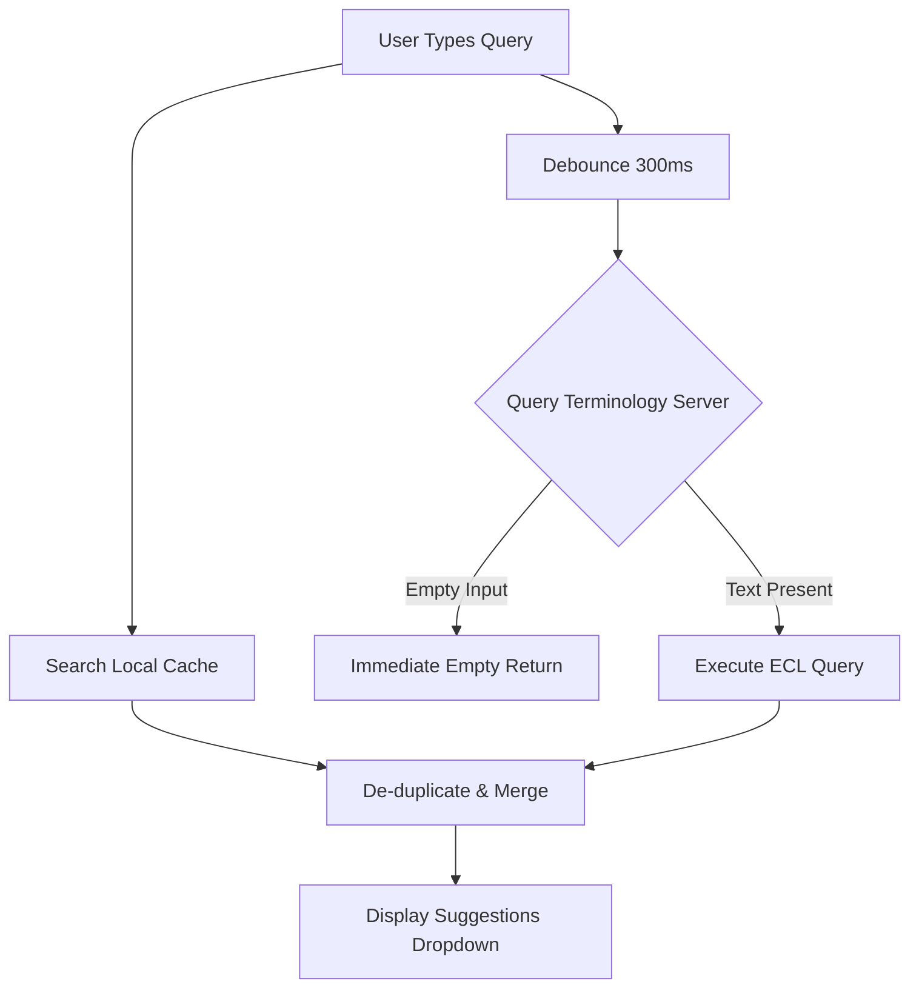

# Zudoc Prescription Platform - Design Specification

This document details the engineering and design decisions implemented in the Zudoc clinical workspace frontend and search backend.

---

## 1. Workspace State Isolation Design

### Problem
Previously, a single shared state model caused data leakage across specialized clinic portals. Selecting a symptom, medication, or diagnosis in the General Medicine tab would populate that concept in other unrelated workspaces (e.g., Veterinary, Dental, Siddha), creating clinical confusion and invalid data.

### Solution
We implemented a strict **state-partitioning architecture** at the root layer (`App.tsx`):
- **Hook Instantiation**: Instead of a single shared state hook, we instantiate six independent instances of the state hook:
  ```typescript
  const generalPresc = usePrescription();
  const ayurvedaPresc = usePrescription();
  const dentalPresc = usePrescription();
  const siddhaPresc = usePrescription();
  const nursingPresc = usePrescription();
  const veterinaryPresc = usePrescription();
  ```
- **Context Synchronization**: The left-hand summary pane and right-hand AI Assistant panel automatically sync with the active workspace by mapping the `activeSpecialty` tab to the correct active hook reference:
  ```typescript
  const activePresc = 
    activeSpecialty === 'ayurveda' ? ayurvedaPresc :
    activeSpecialty === 'dental' ? dentalPresc :
    activeSpecialty === 'siddha' ? siddhaPresc :
    activeSpecialty === 'nursing' ? nursingPresc :
    activeSpecialty === 'veterinary' ? veterinaryPresc :
    generalPresc;
  ```
- **Propagating Workspace Context**: Component props are supplied dynamically using a helper mapper `getWorkspaceProps(presc)` which binds workspace-specific state and handlers to prevent cross-workspace interaction.

---

## 2. Advanced Autocomplete & Local Suggestion Caching

To deliver sub-second response times for clinical lookups, we designed a hybrid terminology suggestion engine combining client-side history caching with server-side queries.



### Caching Architecture
- **Namespace-Isolated Cache**: Cached concepts are saved in `localStorage` under `zudoc_recent_concepts_v2` with key pattern `${workspaceId}_${snomedHierarchy}`. This ensures Veterinary selections never boost suggestions in Dental or General workspaces.
- **Workspace Normalization**: A mapping layer normalizes key variations (such as `allopathy` to `general`, `vetnary`/`vet` to `veterinary`, and `ayrvedha` to `ayurveda`) to ensure unified local database storage keys.
- **Size Constraint**: The cache is capped at 1,000 unique records per workspace to optimize memory footprint.
- **Boosting Metrics**:
  - **Frequency Boosting**: Any concept selected $\ge 3$ times is marked as `isFrequent` and receives a Flame icon.
  - **Recency Prioritization**: Selections from the last 24 hours or the top 5 newest items are marked as `isRecent` and receive a Clock icon.
  - **Sorting**: Cached items are sorted so that **Frequent** items rank highest, followed by **Recent** items, and then by lexicographical match. Local suggestions are placed at the very top of the autocomplete dropdown.
- **Fallback Merging**: Stored items are dynamically merged with common concept lists (`COMMON_ITEMS`) at load time. This ensures that empty databases display useful default suggestions (like complete blood count or chest X-ray) below the user's custom recents rather than showing a blank dropdown.
- **Auto-Capture Pipeline**: Logged entries are captured at four points:
  1. Keystroke Submission (pressing Enter or clicking items in autocomplete tag inputs).
  2. Form Formulations (submitting medications, labs, radiology, or surgeries).
  3. AI Panel selections (selecting clinical recommendations).
  4. Bulk Saving (clicking "Save Draft" or "Sign & Send" extracts all symptoms, diagnoses, medications, labs, radiology, and surgeries, registering them to the local workspace-specific database).

---

## 3. Terminology & Query Latency Optimization

### Problem
Clicking or focusing on any autocompleting field initiated a backend search query with an empty input term. In Elasticsearch and Snowstorm, evaluating descendant concepts (e.g., all 100k+ concepts under `<< 404684003 |Clinical finding|`) without a text term filter forced a heavy database scan. Furthermore, queries under 3 characters triggered `400 Bad Request` exceptions on Snowstorm and heavy, slow prefix scans (up to 3.4 seconds) for broad matches (like `fev`).

### Optimization Strategy
1. **Focus & Length Constraints**: We modified both `searchSnomed` and `searchDrugs` on the frontend (`snomed.ts`), and the search proxy endpoints on the backend (`main.go`), to immediately reject queries under 3 characters (`query.trim().length < 3`) and return empty results instantly (under 5ms). This avoids database scans and server-side errors completely.
2. **Request Coalescing**: We introduced a Promise-based cache registry (`snomedPromises` and `drugPromises`) in the frontend. Concurrent duplicate requests (such as simultaneous queries from the input autocomplete and the AI recommendations panel) share the same promise instance, making only one network fetch call.
3. **Correct Allergy ECL Constraint**: The ECL constraint for allergies was previously `<< 419511003` (Propensity to adverse reactions to drug). This was incorrect because food allergies (e.g. peanut), environmental allergies (e.g. dust, pollen), and animal dander allergies were completely omitted. We corrected the hierarchy to `<< 420134006` (*Propensity to adverse reaction*), which correctly covers all allergy domains and responds rapidly.

---

## 4. Veterinary Concept Isolation (VetMed Extension)

SNOMED CT extension concepts for veterinary medicine contain a unique namespace ID `1000009` (e.g. `Canine parvovirus infection` -> SCTID `342481000009106`).

To prevent veterinary findings from polluting human diagnostic lookups:
- **Filtering**: `searchSnomed` accepts a `workspaceId` context. If the current active workspace is **not** `'veterinary'`, we filter out any concept IDs containing `'1000009'`:
  ```typescript
  return (data.items || [])
    .map(item => ({ id: item.conceptId, name: item.pt?.term ... }))
    .filter(concept => showVet || !concept.id.includes('1000009'));
  ```
- **Namespace Coverage**: This allows veterinarians to access full animal diagnostic terms, while human general practitioners see clean, human-appropriate SNOMED concepts.

---

## 5. PostgreSQL Connection & Draft Save Optimization

### Problem
The database URL parameter string loaded from environment variables (`DATABASE_URL`) included the query parameter `?schema=public` (Prisma-specific). Standard Go PostgreSQL drivers (like `pgx`) pass all query parameters directly to the database server. PostgreSQL rejected the parameter during connection setup with a `FATAL: unrecognized configuration parameter "schema"` error, rendering the connection pool unhealthy and causing draft saves to fail or time out.

### Solution
We implemented a URL query parameter sanitizer in the Go backend (`main.go`) to dynamically parse the `DATABASE_URL` and strip the `schema` parameter prior to initializing the connection pool (`pgxpool`). This resolved the FATAL parameter error, ensuring that persistent healthy connections are maintained and reducing draft save operations to under **45ms** (down from seconds of timeout retry delay).
