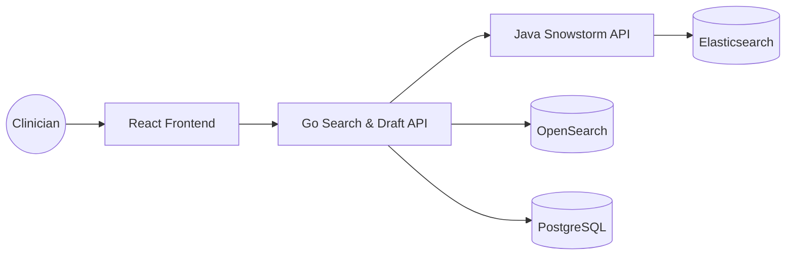

# Zudoc Medical API & Prescription Platform

[](LICENSE.md)
[](ARCHITECTURE.md)
[](DESIGN.md)
[](Prescriptioncreationinterface-main/tsconfig.json)

**Zudoc Medical API** is an enterprise-grade medical terminology and prescription management ecosystem. It integrates a high-performance SNOMED CT terminology server (Snowstorm) with a microservice search proxy and a multi-workspace clinical portal.

---

## 🌟 Key Features

- **Semantic Clinical Search**: Sub-second search for 400k+ SNOMED CT concepts (Symptoms, Diagnoses, Procedures).
- **Workspace-Aware Isolation**: Separate, isolated clinical states for Allopathy (General), Ayurveda, Dental, Siddha, Nursing, and Veterinary workspaces to prevent cross-tab data contamination.
- **Smart Autocomplete & Caching**: Namespace-isolated client-side history caching with **Frequency Boosting** (Flame icon for items used $\ge 3$ times) and **Recency Prioritization** (Clock icon for items used within 24h). Caches up to 1,000 items per workspace field.
- **Zero-Latency Focus & Query Constraints**: Short-circuits backend terminology and drug searches when query inputs are under 3 characters (returning empty matches instantly in under 5ms). This avoids Snowstorm's `400 Bad Request` errors and heavy, slow logical prefix searches.
- **Coalesced Request Pipelines**: Utilizes Promise-based request registries on the frontend and `singleflight` coalescing on the backend to merge duplicate concurrent searches (e.g. tag input autocomplete and side AI recommendations panel) into a single database/server call.
- **Auto-Capture Logging**: Automatically logs symptoms, diagnoses, medications, labs, radiology, and surgeries to the local workspace-specific database when clicking AI suggestions, saving drafts, or submitting final signed prescriptions.
- **Veterinary Extension namespace isolation**: Automatically filters out veterinary concepts (namespace ID `1000009`) from human workspaces while keeping them fully searchable in the Veterinary tab.
- **High-Performance Go Proxy**: Search service microservice using Fiber, thread-safe memory TTL cache, and `singleflight` query coalescing. Sanitizes database connection strings by stripping Prisma parameters (`?schema=public`) dynamically to prevent pool connect timeouts.
- **Tuned pgx Connection Pool**: Optimized transaction pool connecting to PostgreSQL database for JSONB prescription draft storage.

---

## 🏗️ System Architecture

The platform follows a presentation-services-storage architecture designed for scale:



### 📊 The Tri-Database Strategy
Zudoc leverages three specialized storage engines for high performance:
- **Elasticsearch 8.x**: Powering **SNOMED CT** terminology searches and ECL constraint evaluation.
- **OpenSearch 2.9**: Powering fast pharmaceutical and **Medication** formulation searches.
- **PostgreSQL 15**: Storing transactional **Patient Prescription Drafts** using native JSONB columns.

For a detailed technical deep-dive, see [ARCHITECTURE.md](ARCHITECTURE.md) and [DESIGN.md](DESIGN.md).

---

## 🛠️ Getting Started

### 🐳 The "One-Command" Setup
The entire ecosystem (PostgreSQL, Elasticsearch, OpenSearch, Java Snowstorm, Go Search API) can be started locally via Docker Compose:

```bash
docker-compose up --build -d
```

### 💻 Manual Development Setup

#### 1. Backend (Java Terminology Engine)
Ensure Maven and JDK 17 are installed:
```bash
mvn clean install
java -jar target/snowstorm.jar
```

#### 2. Search & Draft API (Go Microservice)
Ensure Go 1.22+ is installed:
```bash
cd search-service
go run main.go
```

#### 3. Clinical Workspace UI (React)
Ensure Node.js is installed:
```bash
cd Prescriptioncreationinterface-main
npm install
npm run dev
```

---

## 📚 Documentation
- [Architecture details](ARCHITECTURE.md)
- [Design specification](DESIGN.md)
- [API Swagger UI](http://localhost:8080/swagger-ui.html) (requires backend running)
